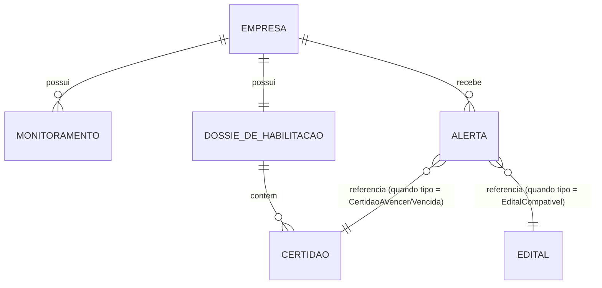

# Modelo de Domínio — Detalhamento de Entidades

Complementa a SPEC-00 (seção 4, que traz os agregados em nível de visão
geral). Este documento é a referência única de atributos, tipos e
invariantes — todo `/plan` de feature (SPEC-01 em diante) reaproveita o que
está aqui em vez de redefinir entidade equivalente com outro nome ou outro
atributo. Ainda não é código: tipos aqui são intenção de modelagem, não
declaração TypeScript.

## 1. Objetos de valor (compartilhados entre agregados)

Objetos de valor não têm identidade própria — são comparados pelo valor dos
seus atributos, e são imutáveis.

| Objeto de valor | Atributos | Regra de validação |
|---|---|---|
| `Cnpj` | `numero: string` (14 dígitos) | dígito verificador válido; sem formatação (sem pontuação) |
| `Cnae` | `codigo: string`, `descricao: string` | código no formato oficial (ex.: `4120-4/00`) |
| `Regiao` | `uf: string` (2 letras), `municipio: string \| null` | UF obrigatória; município opcional (região pode ser o estado inteiro) |
| `Dinheiro` | `valorEmCentavos: number`, `moeda: "BRL"` | nunca `float` para valor monetário — sempre centavos inteiros |
| `PeriodoDeValidade` | `dataDeEmissao: Date`, `dataDeValidade: Date` | `dataDeValidade` posterior a `dataDeEmissao` |
| `ReferenciaDeArquivo` | `caminho: string`, `nomeOriginal: string`, `enviadoEm: Date` | caminho aponta para armazenamento, nunca o binário embutido na entidade |

## 2. Enumerações do domínio

| Enumeração | Valores |
|---|---|
| `CategoriaDeHabilitacao` | `Juridica`, `FiscalETrabalhista`, `EconomicoFinanceira`, `Tecnica` |
| `TipoDeDocumentoDeHabilitacao` | `CndFederal`, `CrfFgts`, `Cndt`, `CertidaoEstadual`, `CertidaoMunicipal`, `CertidaoNegativaDeFalencia`, `AtestadoDeCapacidadeTecnica`, `ContratoSocial` — cada valor associado a exatamente uma `CategoriaDeHabilitacao`, conforme a Lei 14.133/2021: `ContratoSocial` → `Juridica`; `CndFederal`, `CrfFgts`, `Cndt`, `CertidaoEstadual`, `CertidaoMunicipal` → `FiscalETrabalhista`; `CertidaoNegativaDeFalencia` → `EconomicoFinanceira`; `AtestadoDeCapacidadeTecnica` → `Tecnica` (SPEC-04) |
| `SituacaoDaCertidao` | `Valida`, `AVencer`, `Vencida` — **calculada**, nunca persistida diretamente (ver seção 4); janela de alerta fixa de 30 dias corridos antes de `dataDeValidade` para `AVencer` (SPEC-04) |
| `TipoDeAlerta` | `EditalCompativel`, `CertidaoAVencer`, `CertidaoVencida` |
| `CanalDeNotificacao` | `WhatsApp` (único no MVP — ver SPEC-00 seção 9.1 para canais futuros) |
| `StatusDoEnvio` | `Pendente`, `Enviado`, `FalhouNoEnvio` |

## 3. Agregado `Empresa`

Raiz do agregado. Identidade: `EmpresaId` (UUID).

| Atributo | Tipo | Observação |
|---|---|---|
| `id` | `EmpresaId` | gerado na criação, nunca reatribuído |
| `cnpj` | `Cnpj` | identidade de negócio — única no sistema |
| `razaoSocial` | `string` | nome legal, não abreviado |
| `monitoramentos` | `Monitoramento[]` | entidades filhas, ver abaixo |

### Entidade filha `Monitoramento` (vive dentro do agregado `Empresa`)

| Atributo | Tipo | Observação |
|---|---|---|
| `id` | `MonitoramentoId` | único dentro da Empresa |
| `segmento` | `Cnae` | usado para filtrar edital relevante (SPEC-03) |
| `regiao` | `Regiao` | usado para filtrar edital relevante (SPEC-03) |
| `ativo` | `boolean` | permite pausar sem apagar histórico |

**Invariante:** uma `Empresa` não pode ter dois `Monitoramento` com o mesmo
par `(segmento, regiao)` — evita alerta duplicado pela mesma combinação
(ver SPEC-00, seção 4).

## 4. Agregado `DossiêDeHabilitação`

Um por `Empresa` (relação 1—1). Identidade: `DossiêId`.

| Atributo | Tipo | Observação |
|---|---|---|
| `id` | `DossiêId` | |
| `empresaId` | `EmpresaId` | referência, não composição — o dossiê é seu próprio agregado |
| `certidoes` | `Certidao[]` | entidades filhas |

### Entidade filha `Certidão`

| Atributo | Tipo | Observação |
|---|---|---|
| `id` | `CertidaoId` | |
| `tipo` | `TipoDeDocumentoDeHabilitacao` | determina a `categoria` (derivado do tipo, não duplicado como campo) |
| `periodoDeValidade` | `PeriodoDeValidade` | emissão + validade |
| `arquivo` | `ReferenciaDeArquivo` | upload manual — nunca preenchido por automação de portal (constituição, princípio 7) |

**Método de domínio, não atributo persistido:** `situacaoEm(data: Date):
SituacaoDaCertidao` — calcula `Valida`, `AVencer` (dentro da janela de
alerta configurada) ou `Vencida` comparando `data` com
`periodoDeValidade.dataDeValidade`. Guardar a situação como campo fixo
criaria uma segunda fonte de verdade que fica desatualizada sozinha —
por isso é sempre calculada na hora, nunca armazenada.

**Método de domínio do agregado:** `calcularProntidaoParaEdital(edital:
Edital, hoje: Date): Prontidao` — cruza as categorias de habilitação
exigidas pelo edital com a situação atual de cada `Certidão` e devolve um
placar (`Apta`, `Pendente`, `Inapta`) mais a lista de pendências
específicas. Esta é a regra citada na SPEC-00 como
`calcularProntidãoParaEdital` (SPEC-05).

**Invariante:** uma `Certidão` com `situacaoEm(hoje) == Vencida` nunca
conta como cumprindo sua categoria, independente de qualquer outro campo.

## 5. Agregado `Edital`

Identidade: `EditalId`, derivada de `numeroDeProcesso + orgao`.

| Atributo | Tipo | Observação |
|---|---|---|
| `id` | `EditalId` | |
| `numeroDeProcesso` | `string` | identificador do órgão emissor |
| `orgao` | `{ nome: string, esfera: "Federal" \| "Estadual" \| "Municipal" \| "Distrital" }` | `Distrital` cobre órgão do Distrito Federal (esferaId "D" na API do PNCP) — não confundir com "Estadual" |
| `regiao` | `Regiao` | UF (e, se disponível, município) do órgão emissor — usado para filtrar edital relevante (SPEC-03), da mesma forma que `Monitoramento.regiao` |
| `objeto` | `string` | descrição textual do que está sendo contratado |
| `valorEstimado` | `Dinheiro` | |
| `dataDePublicacao` | `Date` | |
| `dataDeEntregaDaProposta` | `Date` | prazo — usado para calcular urgência |
| `segmentoInferido` | `Cnae \| null` | resultado do processo de compatibilidade (SPEC-03), não o CNAE literal do órgão; `null` desde a ingestão (SPEC-02) até a SPEC-03 processar o Edital |
| `classificacaoDoItem` | `{ codigo: string, descricao: string } \| null` | código de classificação bruto do item da compra, capturado na ingestão (SPEC-02/SPEC-03); sem validação de formato de CNAE — a fonte (PNCP) não garante esse formato. É o dado de entrada comparado contra `Monitoramento.segmento` para decidir `segmentoInferido`; `null` até a ingestão conseguir popular esse campo |
| `versao` | `number` | incrementada a cada republicação; nunca sobrescreve histórico (SPEC-00, seção 4) |

**Invariante:** um `Edital` já publicado é imutável — qualquer atualização
de conteúdo gera uma nova versão do mesmo `EditalId`, preservando a versão
anterior.

## 6. Agregado `Alerta`

Identidade: `AlertaId`. Pertence a uma `Empresa` (referência, não
composição).

| Atributo | Tipo | Observação |
|---|---|---|
| `id` | `AlertaId` | |
| `empresaId` | `EmpresaId` | destinatário |
| `tipo` | `TipoDeAlerta` | |
| `origem` | `{ tipo: "Edital" \| "Certidao", id: EditalId \| CertidaoId }` | o que disparou o alerta |
| `canal` | `CanalDeNotificacao` | |
| `status` | `StatusDoEnvio` | |
| `momentoDeEnvio` | `Date \| null` | `null` enquanto `status == Pendente` |

**Invariante:** a mesma combinação `(empresaId, tipo, origem)` nunca gera
um segundo `Alerta` com `status != FalhouNoEnvio` — evita notificação
duplicada do mesmo evento (SPEC-00, seção 4). Uma falha de envio pode ser
reenviada; um alerta já entregue, não.

## 7. Diagrama de relacionamento

## 8. Qual SPEC introduz qual entidade

| Entidade / objeto de valor | Introduzido em |
|---|---|
| `Empresa`, `Monitoramento`, `Cnpj`, `Cnae`, `Regiao` | SPEC-01 |
| `Edital`, `Dinheiro` | SPEC-02 |
| `segmentoInferido` (regra de compatibilidade), `classificacaoDoItem` | SPEC-03 |
| `DossiêDeHabilitação`, `Certidão`, `PeriodoDeValidade`, `ReferenciaDeArquivo`, `SituacaoDaCertidao` | SPEC-04 |
| `calcularProntidaoParaEdital`, `Prontidao` | SPEC-05 |
| `Alerta`, `TipoDeAlerta`, `StatusDoEnvio` | SPEC-06 |
| `CanalDeNotificacao` (envio de fato) | SPEC-07 |

Nenhuma dessas entidades é redefinida no `/plan` de cada SPEC — o plano
técnico da feature referencia este documento e detalha só o incremento
(novo método, nova coluna Prisma) que aquela SPEC específica introduz.